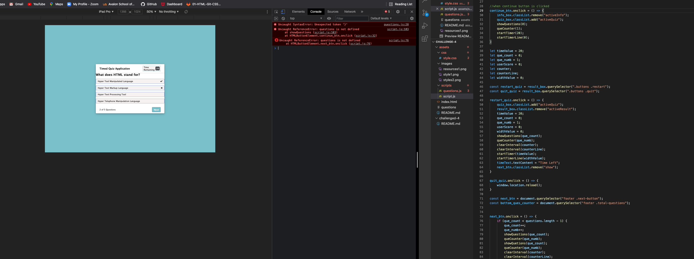
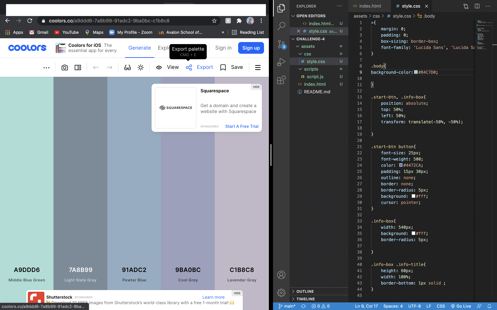
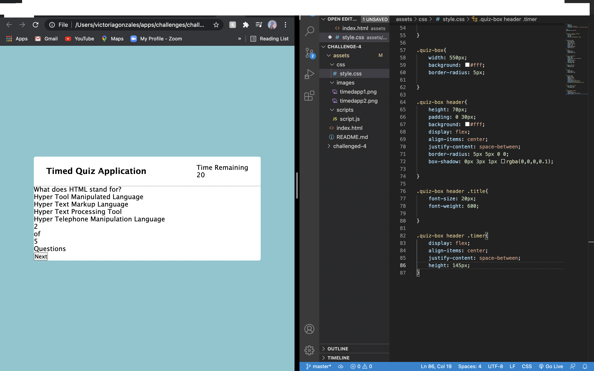
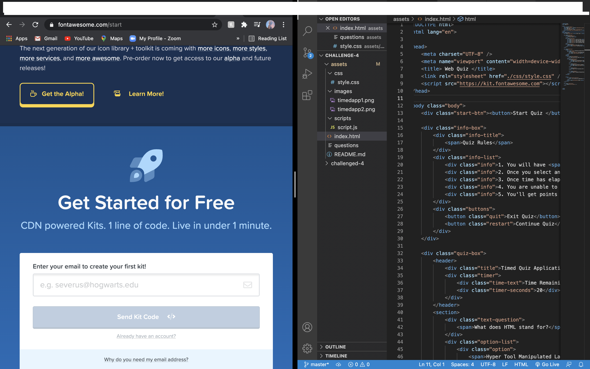

# Challenge 4- Timed Test Application 
> Lets take a Web Development Quiz!
---
### Table of Contents
- [Description](#description)
- [Introduction](#introduction)
- [Challenges](#challenges)
- [Victories](#victories)
- [Resources](#resources)

---

## Description

Challenge #4- Timed quiz generator 

## Introduction 
This week we were challenged to create a timed quiz. I decided to base my questions on some knowledge I have gained in the coarse so far!  I really enjoyed creating this quiz! 

---

## Challenges

Creating applications from the ground up can be challenging. My biggest challenge was really just remembering the correct order of the syntax. I made sure to use as many resources as possilble!

---

I have done alot extra reaserch in this challenge. I was really challenged to use alot of resources and problem solve. Al little over 30 hours was spent on this challenge, I used alot of new knowledge! Organization has also been one of my top priorities. The idea, is for the code to read like a book. Gotta love formatting! (shift + command + f)

---

I spent several hours trying to get the app to respond with JavaScript. This in itself was very challenging.

---

## VIctories
I really enjoyed designing the page and using "Coolors" as a resource for color pallets!

---
The app started to come along really nicely as I began to add style to it!

---

The design aspect is proabably my favorite part of the process. I found another really cool resource for adding icons! I decided to utilize that also! 

## Resources 

<a href="https://github.com/torigonzales/challenged-4">GitHub Repo</a>

<a href="https://www.youtube.com/watch?v=eVGEea7adDM"> YouTube</a>

<a href="https://www.google.com/webhp?hl=en&sa=X&ved=0ahUKEwiLjJ7fosLvAhWXW80KHawRD_oQPAgI">Google</a>

<a href="https://www.w3schools.com/charsets/ref_html_ascii.asp">w3 Schools</a>

<a href="https://coolors.co/">Coolors</a>

